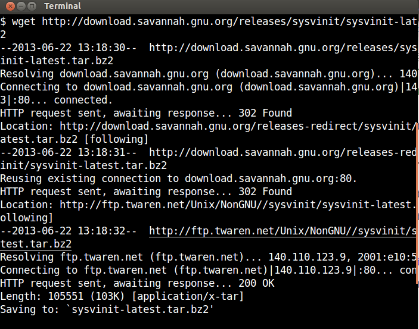
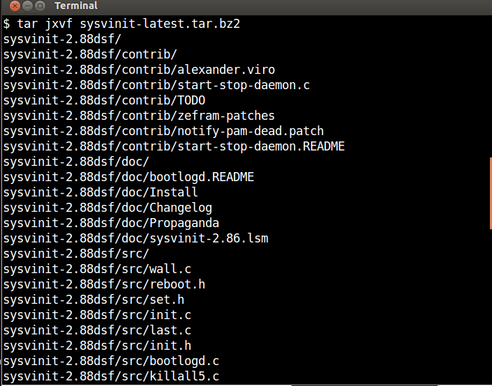
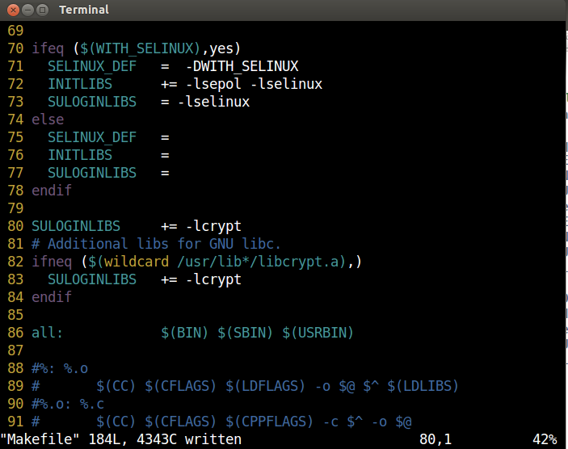
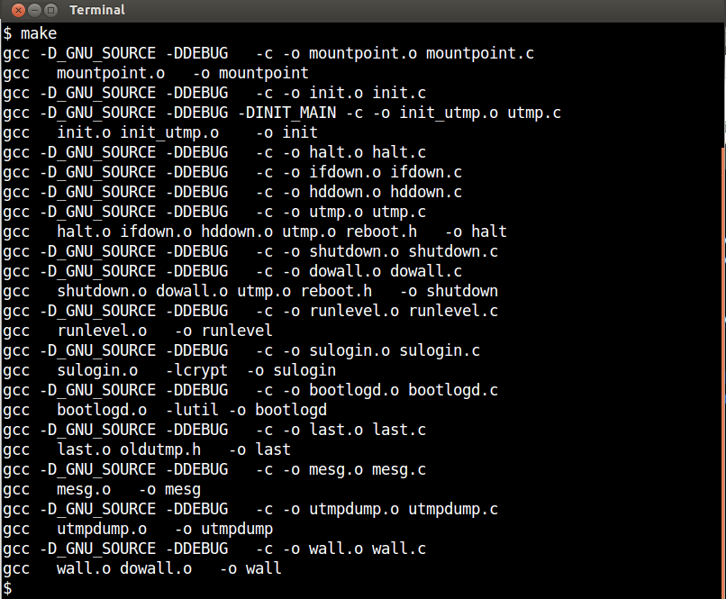
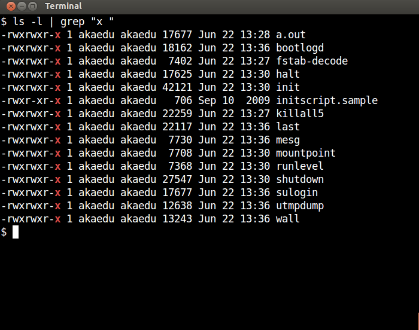
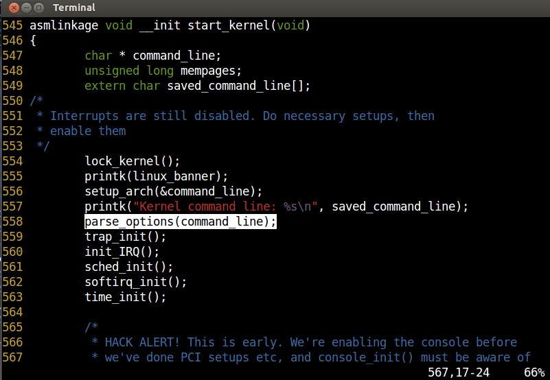
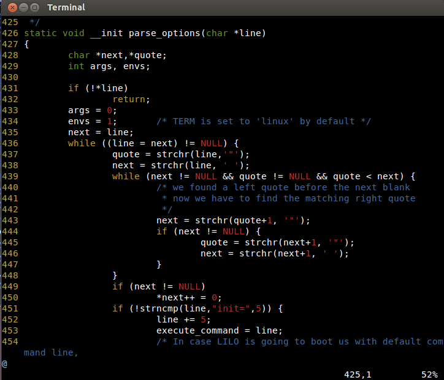
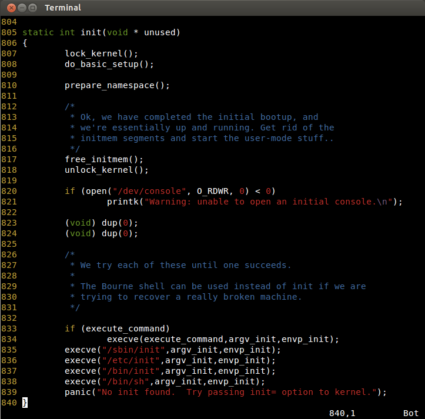
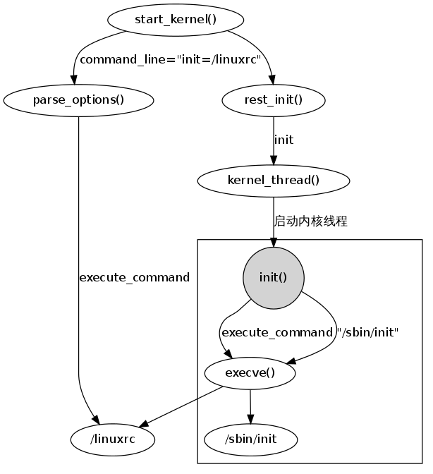

# Sysvinit 项目工具简介

## 项目背景介绍

安装的程序
halt, init, killall5, last, lastb (链接到 last), mesg, pidof (链接到 killall5), poweroff (链接到 halt), reboot (链接到 halt), runlevel, shutdown, sulogin, telinit (链接到 init), utmpdump, wall
简要描述

## 项目架构设计

# Sysvinit 项目概要分析

## 工具安装使用流程
Sysvinit软件包包含控制启动，运行和关闭所有其他程序的工具。

所有工具编译之后都生成在 src 源码目录树下，同时，这些命名的帮助文件在 man 目录下。

	$ ls -l
	total 108
	-rw-r--r-- 1 akaedu akaedu  2847 Jun 23 11:13 bootlogd.8
	-rw-r--r-- 1 akaedu akaedu  1971 Jun 23 11:13 bootlogd.8.todo
	-rw-r--r-- 1 akaedu akaedu  1444 Jun 23 11:13 fstab-decode.8
	-rw-r--r-- 1 akaedu akaedu  3957 Jun 23 11:13 halt.8
	-rw-r--r-- 1 akaedu akaedu 12124 Jun 23 11:13 init.8
	-rw-r--r-- 1 akaedu akaedu  2428 Jun 23 11:13 initscript.5
	-rw-r--r-- 1 akaedu akaedu  8290 Jun 23 11:13 inittab.5
	-rw-r--r-- 1 akaedu akaedu  1866 Jun 23 11:13 killall5.8
	-rw-r--r-- 1 akaedu akaedu  4242 Jun 23 11:13 last.1
	-rw-r--r-- 1 akaedu akaedu    16 Jun 23 11:13 lastb.1
	-rw-r--r-- 1 akaedu akaedu  1867 Jun 23 11:13 mesg.1
	-rw-r--r-- 1 akaedu akaedu  1886 Jun 23 11:13 mountpoint.1
	-rw-r--r-- 1 akaedu akaedu  3230 Jun 23 11:13 pidof.8
	-rw-r--r-- 1 akaedu akaedu    16 Jun 23 11:13 poweroff.8
	-rw-r--r-- 1 akaedu akaedu    16 Jun 23 11:13 reboot.8
	-rw-r--r-- 1 akaedu akaedu  1872 Jun 23 11:13 runlevel.8
	-rw-r--r-- 1 akaedu akaedu  8017 Jun 23 11:13 shutdown.8
	-rw-r--r-- 1 akaedu akaedu  3309 Jun 23 11:13 sulogin.8
	-rw-r--r-- 1 akaedu akaedu    16 Jun 23 11:13 telinit.8
	-rw-r--r-- 1 akaedu akaedu  1949 Jun 23 11:13 utmpdump.1
	-rw-r--r-- 1 akaedu akaedu  1960 Jun 23 11:13 wall.1

通过使用 man 命令，加上 -l 参数，例如 man -l init.8 我们可以了解到这些命令的用法。

* 注意  

我们这里没有直接使用例如 man init 这样的命令，而是改用 man -l init.8，这是因为前者是查看当前系统的帮助，而当前系统是 ubuntu 12.04 已经改用 upstart 作为 init 进程。后者才是针对 sysvinit 工具中的可执行文件配套的帮助信息。 

下面我们针对这些命令的帮助信息，来给出每个命令的具体用法，在测试案例报告中，我们会详细说明每个命令如何使用。

### init 命令

#### init 命令说明
init 进程是所有进程的父进程。它的主要任务就是从 /etc/inittab 文件中读取命令行，从而创建出一系列后继进程。
init 进程本身是被 Kernel 所启动，Kernel 将控制权交给它之后，用它来负责启动所有其他的进程。
inittab 文件中通常有关于登录接口的定义，就是在每个终端产生getty，使用户可以进行登录.
	
#### 命令格式
       /sbin/init [ -a ] [ -s ] [ -b ] [ -z xxx ] [ 0123456Ss ]

#### 运行级别
运行级别是Linux操作系统的一个软件配置，用它来决定启动哪些程序集来运行。
系统启动时，可以根据 /etc/inittab 文件的配置，进入不同的运行级别。
每个运行级别可以设置启动不同的程序。

启动的每个程序都是init的进程的子进程，运行级别有8个，分别是 0-6,S或s。
运行级别0,1和6是系统保留的。

* 运行级别0用来关闭系统，
* 运行级别1先关闭所有用户进程和服务，然后进入单用户模式。
* 运行级别6用来重启系统。
* 运行级别S和s，会直接进入到单用户模式。
	- 这种模式下不再需要 /etc/inittab 文件。
	- /sbin/sulogin 会在 /dev/console 上 被启动。
	- 运行级别S和s的功能是相同的。

#### 启动过程
在kernel启动的最后阶段，会调用init。init会查找/etc/inittab文件内容，进入指定的运行级别。
其中 initdefault 代表着系统默认要进入的运行级别，如果用户指定了，就会进入到 initdefault 代表的那个运行级别。
如果用户没有指定，则系统启动时，会通过 console 来要求用户输入一个运行级别。

当启动一个新进程时，init会先检查/etc/initscript文件是否存在。如果存在，则使用这个脚本来启动那个进程。

#### 选项
* -s, S, single  
	进入单用户模式.

* 1-5  
	启动进入的运行级别.

* -b, emergency  
	直接进入单用户shell，不运行任何其他的启动脚本。

* -a, auto  
	如果指定该参数，init 会将 AUTOBOOT 环境变量设置为 yes。 

* -z xxx  
	-z后面的参数将被忽略。可以使用这种方法将命令行加长一点，这样可以增加在堆栈中占用的空间。

### shutdown 命令

#### shutdown 命令说明
shutdown 以一种安全的方式终止系统，所有正在登录的用户都会收到系统将要终止的通知，并且不准新的登录。

#### 命令格式

#### 运行级别

#### 启动过程

### halt 命令

#### halt 命令说明
halt 停止系统。通常以 -h 参数调用 shutdown，但如果已经在运行级0的话，它就告诉内核终止系统。在这之前，它会检查文件 /var/log/wtmp，看系统是否正在关闭。

正常情况下等效于 shutdown 加上 -h 参数(当前系统运行级别是 0 时除外)。它将告诉内核去中止系统，并在系统正在关闭的过程中将日志记录到 /var/log/wtmp 文件里。

#### 停止系统

#### 主要选项：
* -n  
	reboot或者halt之前，不同步(sync)数据.
* -w  
	仅仅往/var/log/wtmp里写一个记录，并不实际做reboot或者halt操作.
* -f  
	强制halt或者reboot，不等其他程序退出或者服务停止就重新启动系统.这样会造成数据丢失，建议一般不要这样做.
* -i  
	halt或reboot前，关闭所有网络接口.
* -h  
	halt或poweroff前，使系统中所有的硬件处于等待状态.
* -p  
	在系统halt同时，做poweroff操作.即停止系统同时关闭电源.

### poweroff 命令
poweroff 关闭系统并切断电源。但请参看halt。

poweroff
告诉内核中止系统并且关闭系统(参见 halt)

### reboot 命令

reboot
告诉内核重启系统(参见 halt)

### telinit 命令

telinit 告诉 init 该进入哪个运行级。

telinit
告诉 init 将切换到那一个运行级

### killall5/pidof 命令

killall5
发送一个信号到所有进程，但那些在它自己设定级别的进程将不会被这个运行的脚本所中断。

killall5 就是SystemV的killall命令。向除自己的会话(session)进程之外的其它进程发出信号，所以不能杀死当前使用的shell。

pidof
报告给定程序的PID号

pidof找出程序的进程识别号(pid)，输出到标准输出设备。

### last/lastb 命令

last
给出哪一个用户最后一次登录(或退出登录)，它搜索 /var/log/wtmp 文件，出给出系统引导、关闭、运行级别改变等信息。
lastb
给出登失败的尝试，并写入日志 /var/log/btmp

last 回溯/var/log/wtmp文件(或者-f选项指定的文件)，显示自从这个文件建立以来，所有用户的登录情况。

lastb 显示所有失败登录企图，并记录在 /var/log/btmp.

### mesg 命令
该命令的作用是，控制是否允许在当前终端上显示出其它用户对当前用户终端发送的消息。

### mountpoint 命令

mountpoint
检查给定的目录是否是一个挂载点

查看一个目录是否为一个挂载点：

	[root@test ~]# df 
	Filesystem           1K-blocks      Used Available Use% Mounted on
	/dev/hda2              9918956   8036580   1370388  86% /
	/dev/hda1                99043     20891     73038  23% /boot
	/dev/hda5              9612604   6545956   2578352  72% /data
	tmpfs                   123444         0    123444   0% /dev/shm
	[root@test ~]# mountpoint /
	/ is a mountpoint
	[root@test ~]# mountpoint /boot
	/boot is a mountpoint
	[root@test ~]# mountpoint /home/
	/home/ is not a mountpoint

而且，还可以查看某个文件系统的主/从设备号：

	[root@test ~]# df
	Filesystem           1K-blocks      Used Available Use% Mounted on
	/dev/hda2              9918956   8036580   1370388  86% /
	/dev/hda1                99043     20891     73038  23% /boot
	/dev/hda5              9612604   6545956   2578352  72% /data
	tmpfs                   123444         0    123444   0% /dev/shm
	[root@test ~]# mountpoint -d /
	3:2
	[root@test ~]# mountpoint -d /boot
	3:1

### runlevel 命令

runlevel
告前一个和当前的系统运行级别，并且将最后一些运行级别写入 /var/run/utmp

runlevel 读取系统的登录记录文件(一般是/var/run/utmp)把以前和当前的系统运行级输出到标准输出设备。

### sulogin 命令

sulogin
允许 root 登录，它通常情况下是在系统在单用户模式下运行时，由 init 所派生。

sulogin 允许超级用户登陆。通常是系统进入单用户模式时调用的。

### wall 命令

#### wall说明
wall命令用来向所有用户的终端发送一条信息。发送的信息可以作为参数在命令行给出，也可在执行wall命令后，从终端中输入。
使用终端输入信息时，按Ctrl-D结束输入。wall的信息长度的限制是20行。

只有超级用户有权限，给所有用户的终端发送消息。

* 用法  
	usage: wall [message]

* 举例  
	wall "hello msg"

### bootlogd 命令

### utmpdump 命令

utmpdump
以一个多用户友好的方式列出已经给出的登录文件的目录
utmpdump 以一种用户友好的格式向标准输出设备显示/var/run/utmp文件的内容。

## 代码实现概要分析

### 源码目录结构
	$ make distclean
	make -C src distclean
	make[1]: Entering directory `/home/akaedu/Github/sysvinit/sysvinit-2.88dsf/src'
	rm -f *.o *.bak
	rm -f  mountpoint init halt shutdown runlevel killall5 fstab-decode sulogin bootlogd last mesg utmpdump wall
	make[1]: Leaving directory `/home/akaedu/Github/sysvinit/sysvinit-2.88dsf/src'
	$ make clean
	$ tree
	.
	├── contrib
	│   ├── alexander.viro
	│   ├── notify-pam-dead.patch
	│   ├── start-stop-daemon.c
	│   ├── start-stop-daemon.README
	│   ├── TODO
	│   └── zefram-patches
	├── COPYING
	├── COPYRIGHT
	├── doc
	│   ├── bootlogd.README
	│   ├── Changelog
	│   ├── Install
	│   ├── Propaganda
	│   └── sysvinit-2.86.lsm
	├── Makefile
	├── man
	│   ├── bootlogd.8
	│   ├── bootlogd.8.todo
	│   ├── fstab-decode.8
	│   ├── halt.8
	│   ├── init.8
	│   ├── initscript.5
	│   ├── inittab.5
	│   ├── killall5.8
	│   ├── last.1
	│   ├── lastb.1
	│   ├── mesg.1
	│   ├── mountpoint.1
	│   ├── pidof.8
	│   ├── poweroff.8
	│   ├── reboot.8
	│   ├── runlevel.8
	│   ├── shutdown.8
	│   ├── sulogin.8
	│   ├── telinit.8
	│   ├── utmpdump.1
	│   └── wall.1
	├── obsolete
	│   ├── bootlogd.init
	│   ├── powerd.8
	│   ├── powerd.c
	│   ├── powerd.cfg
	│   ├── powerd.README
	│   ├── README.RIGHT.NOW
	│   └── utmpdump.c.OLD
	├── README
	└── src
	    ├── a.out
	    ├── bootlogd.c
	    ├── dowall.c
	    ├── fstab-decode.c
	    ├── halt.c
	    ├── hddown.c
	    ├── ifdown.c
	    ├── init.c
	    ├── init.h
	    ├── initreq.h
	    ├── initscript.sample
	    ├── killall5.c
	    ├── last.c
	    ├── Makefile
	    ├── mesg.c
	    ├── mountpoint.c
	    ├── oldutmp.h
	    ├── paths.h
	    ├── reboot.h
	    ├── runlevel.c
	    ├── set.h
	    ├── shutdown.c
	    ├── sulogin.c
	    ├── utmp.c
	    ├── utmpdump.c
	    └── wall.c

	5 directories, 69 files

### Makefile 分析
	 93 init:           LDLIBS += $(INITLIBS) $(STATIC)
	 94 init:           init.o init_utmp.o
	 95 
	 96 halt:           halt.o ifdown.o hddown.o utmp.o reboot.h
	 97 
	 98 last:           last.o oldutmp.h
	 99 
	100 mesg:           mesg.o
	101 
	102 mountpoint:     mountpoint.o
	103 
	104 utmpdump:       utmpdump.o
	105 
	106 runlevel:       runlevel.o
	107 
	108 sulogin:        LDLIBS += $(SULOGINLIBS) $(STATIC)
	109 sulogin:        sulogin.o
	110 
	111 wall:           dowall.o wall.o
	112 
	113 shutdown:       dowall.o shutdown.o utmp.o reboot.h
	114 
	115 bootlogd:       LDLIBS += -lutil
	116 bootlogd:       bootlogd.o

# Sysvinit 项目详细分析

## init 进程代码分析

## 相关其他进程分析

# Sysvinit 项目安全漏洞

# Sysvinit 项目运行时调试图

## 编译安装运行调试图

### wget下载源码包

	$ wget http://download.savannah.gnu.org/releases/sysvinit/sysvinit-latest.tar.bz2
	--2013-06-22 13:18:30--  http://download.savannah.gnu.org/releases/sysvinit/sysvinit-latest.tar.bz2
	Resolving download.savannah.gnu.org (download.savannah.gnu.org)... 140.186.70.73
	Connecting to download.savannah.gnu.org (download.savannah.gnu.org)|140.186.70.73|:80... connected.
	HTTP request sent, awaiting response... 302 Found
	Location: http://download.savannah.gnu.org/releases-redirect/sysvinit/sysvinit-latest.tar.bz2 [following]
	--2013-06-22 13:18:31--  http://download.savannah.gnu.org/releases-redirect/sysvinit/sysvinit-latest.tar.bz2
	Reusing existing connection to download.savannah.gnu.org:80.
	HTTP request sent, awaiting response... 302 Found
	Location: http://ftp.twaren.net/Unix/NonGNU//sysvinit/sysvinit-latest.tar.bz2 [following]
	--2013-06-22 13:18:32--  http://ftp.twaren.net/Unix/NonGNU//sysvinit/sysvinit-latest.tar.bz2
	Resolving ftp.twaren.net (ftp.twaren.net)... 140.110.123.9, 2001:e10:5c00:5::9
	Connecting to ftp.twaren.net (ftp.twaren.net)|140.110.123.9|:80... connected.
	HTTP request sent, awaiting response... 200 OK
	Length: 105551 (103K) [application/x-tar]
	Saving to: `sysvinit-latest.tar.bz2'

	100%[======================================>] 105,551     45.1K/s   in 2.3s    

	2013-06-22 13:18:35 (45.1 KB/s) - `sysvinit-latest.tar.bz2' saved [105551/105551]

### tar解压源码包

	$ tar jxvf sysvinit-latest.tar.bz2 
	sysvinit-2.88dsf/
	sysvinit-2.88dsf/contrib/
	sysvinit-2.88dsf/contrib/alexander.viro
	sysvinit-2.88dsf/contrib/start-stop-daemon.c
	sysvinit-2.88dsf/contrib/TODO
	sysvinit-2.88dsf/contrib/zefram-patches
	sysvinit-2.88dsf/contrib/notify-pam-dead.patch
	sysvinit-2.88dsf/contrib/start-stop-daemon.README
	sysvinit-2.88dsf/doc/
	sysvinit-2.88dsf/doc/bootlogd.README
	sysvinit-2.88dsf/doc/Install
	sysvinit-2.88dsf/doc/Changelog
	sysvinit-2.88dsf/doc/Propaganda
	sysvinit-2.88dsf/doc/sysvinit-2.86.lsm
	sysvinit-2.88dsf/src/
	sysvinit-2.88dsf/src/wall.c
	sysvinit-2.88dsf/src/reboot.h
	sysvinit-2.88dsf/src/set.h
	sysvinit-2.88dsf/src/init.c
	sysvinit-2.88dsf/src/last.c
	sysvinit-2.88dsf/src/init.h
	sysvinit-2.88dsf/src/bootlogd.c
	sysvinit-2.88dsf/src/killall5.c
	sysvinit-2.88dsf/src/utmpdump.c
	sysvinit-2.88dsf/src/shutdown.c
	sysvinit-2.88dsf/src/mountpoint.c
	sysvinit-2.88dsf/src/sulogin.c
	sysvinit-2.88dsf/src/fstab-decode.c
	sysvinit-2.88dsf/src/initreq.h
	sysvinit-2.88dsf/src/dowall.c
	sysvinit-2.88dsf/src/hddown.c
	sysvinit-2.88dsf/src/paths.h
	sysvinit-2.88dsf/src/utmp.c
	sysvinit-2.88dsf/src/ifdown.c
	sysvinit-2.88dsf/src/initscript.sample
	sysvinit-2.88dsf/src/halt.c
	sysvinit-2.88dsf/src/oldutmp.h
	sysvinit-2.88dsf/src/mesg.c
	sysvinit-2.88dsf/src/Makefile
	sysvinit-2.88dsf/src/runlevel.c
	sysvinit-2.88dsf/COPYING
	sysvinit-2.88dsf/COPYRIGHT
	sysvinit-2.88dsf/man/
	sysvinit-2.88dsf/man/bootlogd.8
	sysvinit-2.88dsf/man/killall5.8
	sysvinit-2.88dsf/man/shutdown.8
	sysvinit-2.88dsf/man/bootlogd.8.todo
	sysvinit-2.88dsf/man/sulogin.8
	sysvinit-2.88dsf/man/fstab-decode.8
	sysvinit-2.88dsf/man/mesg.1
	sysvinit-2.88dsf/man/initscript.5
	sysvinit-2.88dsf/man/inittab.5
	sysvinit-2.88dsf/man/poweroff.8
	sysvinit-2.88dsf/man/wall.1
	sysvinit-2.88dsf/man/halt.8
	sysvinit-2.88dsf/man/reboot.8
	sysvinit-2.88dsf/man/last.1
	sysvinit-2.88dsf/man/runlevel.8
	sysvinit-2.88dsf/man/lastb.1
	sysvinit-2.88dsf/man/pidof.8
	sysvinit-2.88dsf/man/init.8
	sysvinit-2.88dsf/man/utmpdump.1
	sysvinit-2.88dsf/man/mountpoint.1
	sysvinit-2.88dsf/man/telinit.8
	sysvinit-2.88dsf/obsolete/
	sysvinit-2.88dsf/obsolete/powerd.c
	sysvinit-2.88dsf/obsolete/powerd.8
	sysvinit-2.88dsf/obsolete/utmpdump.c.OLD
	sysvinit-2.88dsf/obsolete/README.RIGHT.NOW
	sysvinit-2.88dsf/obsolete/bootlogd.init
	sysvinit-2.88dsf/obsolete/powerd.README
	sysvinit-2.88dsf/obsolete/powerd.cfg
	sysvinit-2.88dsf/Makefile
	sysvinit-2.88dsf/README
	$ 

	$ ls
	Makefile  pdf  sysvinit-2.88dsf  sysvinit-latest.tar.bz2

	$ ls sysvinit-2.88dsf/
	contrib  COPYRIGHT  Makefile  obsolete  src
	COPYING  doc        man       README
	$ 

### 编译项目源码
	$ cd sysvinit-2.88dsf/
	$ make
	cc -ansi -O2 -fomit-frame-pointer -W -Wall -D_GNU_SOURCE   -c -o mountpoint.o mountpoint.c
	cc   mountpoint.o   -o mountpoint
	cc -ansi -O2 -fomit-frame-pointer -W -Wall -D_GNU_SOURCE   -c -o init.o init.c
	init.c: In function ‘telinit’:
	init.c:2737:7: warning: ignoring return value of ‘chdir’, declared with attribute warn_unused_result [-Wunused-result]
	init.c: In function ‘get_record’:
	init.c:377:11: warning: ignoring return value of ‘fscanf’, declared with attribute warn_unused_result [-Wunused-result]
	init.c:380:11: warning: ignoring return value of ‘fscanf’, declared with attribute warn_unused_result [-Wunused-result]
	init.c:383:11: warning: ignoring return value of ‘fscanf’, declared with attribute warn_unused_result [-Wunused-result]
	init.c:386:11: warning: ignoring return value of ‘fscanf’, declared with attribute warn_unused_result [-Wunused-result]
	init.c:389:11: warning: ignoring return value of ‘fscanf’, declared with attribute warn_unused_result [-Wunused-result]
	init.c:392:11: warning: ignoring return value of ‘fscanf’, declared with attribute warn_unused_result [-Wunused-result]
	init.c:395:11: warning: ignoring return value of ‘fscanf’, declared with attribute warn_unused_result [-Wunused-result]
	init.c:398:11: warning: ignoring return value of ‘fscanf’, declared with attribute warn_unused_result [-Wunused-result]
	init.c:401:11: warning: ignoring return value of ‘fscanf’, declared with attribute warn_unused_result [-Wunused-result]
	init.c:404:11: warning: ignoring return value of ‘fscanf’, declared with attribute warn_unused_result [-Wunused-result]
	init.c:423:10: warning: ignoring return value of ‘fscanf’, declared with attribute warn_unused_result [-Wunused-result]
	init.c:426:10: warning: ignoring return value of ‘fscanf’, declared with attribute warn_unused_result [-Wunused-result]
	init.c: In function ‘spawn’:
	init.c:1064:10: warning: ignoring return value of ‘dup’, declared with attribute warn_unused_result [-Wunused-result]
	init.c:1065:10: warning: ignoring return value of ‘dup’, declared with attribute warn_unused_result [-Wunused-result]
	init.c:1133:7: warning: ignoring return value of ‘dup’, declared with attribute warn_unused_result [-Wunused-result]
	init.c:1134:7: warning: ignoring return value of ‘dup’, declared with attribute warn_unused_result [-Wunused-result]
	init.c: In function ‘ask_runlevel’:
	init.c:1673:10: warning: ignoring return value of ‘write’, declared with attribute warn_unused_result [-Wunused-result]
	init.c:1675:9: warning: ignoring return value of ‘read’, declared with attribute warn_unused_result [-Wunused-result]
	init.c: In function ‘make_pipe’:
	init.c:1960:6: warning: ignoring return value of ‘pipe’, declared with attribute warn_unused_result [-Wunused-result]
	init.c:1965:7: warning: ignoring return value of ‘write’, declared with attribute warn_unused_result [-Wunused-result]
	init.c: In function ‘process_signals’:
	init.c:2411:7: warning: ignoring return value of ‘read’, declared with attribute warn_unused_result [-Wunused-result]
	init.c:2420:7: warning: ignoring return value of ‘read’, declared with attribute warn_unused_result [-Wunused-result]
	init.c: In function ‘coredump’:
	init.c:666:7: warning: ignoring return value of ‘chdir’, declared with attribute warn_unused_result [-Wunused-result]
	init.c: In function ‘print’:
	init.c:821:8: warning: ignoring return value of ‘write’, declared with attribute warn_unused_result [-Wunused-result]
	cc -ansi -O2 -fomit-frame-pointer -W -Wall -D_GNU_SOURCE -DINIT_MAIN -c -o init_utmp.o utmp.c
	cc   init.o init_utmp.o    -o init
	cc -ansi -O2 -fomit-frame-pointer -W -Wall -D_GNU_SOURCE   -c -o halt.o halt.c
	halt.c: In function ‘main’:
	halt.c:242:2: warning: ignoring return value of ‘chdir’, declared with attribute warn_unused_result [-Wunused-result]
	cc -ansi -O2 -fomit-frame-pointer -W -Wall -D_GNU_SOURCE   -c -o ifdown.o ifdown.c
	cc -ansi -O2 -fomit-frame-pointer -W -Wall -D_GNU_SOURCE   -c -o hddown.o hddown.c
	cc -ansi -O2 -fomit-frame-pointer -W -Wall -D_GNU_SOURCE   -c -o utmp.o utmp.c
	cc   halt.o ifdown.o hddown.o utmp.o reboot.h   -o halt
	cc -ansi -O2 -fomit-frame-pointer -W -Wall -D_GNU_SOURCE   -c -o shutdown.o shutdown.c
	shutdown.c: In function ‘main’:
	shutdown.c:485:10: warning: variable ‘realuid’ set but not used [-Wunused-but-set-variable]
	shutdown.c:630:9: warning: ignoring return value of ‘fscanf’, declared with attribute warn_unused_result [-Wunused-result]
	shutdown.c:719:7: warning: ignoring return value of ‘chdir’, declared with attribute warn_unused_result [-Wunused-result]
	shutdown.c: In function ‘spawn’:
	shutdown.c:289:7: warning: ignoring return value of ‘chdir’, declared with attribute warn_unused_result [-Wunused-result]
	cc -ansi -O2 -fomit-frame-pointer -W -Wall -D_GNU_SOURCE   -c -o dowall.o dowall.c
	cc   shutdown.o dowall.o utmp.o reboot.h   -o shutdown
	cc -ansi -O2 -fomit-frame-pointer -W -Wall -D_GNU_SOURCE   -c -o runlevel.o runlevel.c
	cc   runlevel.o   -o runlevel
	cc -ansi -O2 -fomit-frame-pointer -W -Wall -D_GNU_SOURCE   -c -o sulogin.o sulogin.c
	sulogin.c: In function ‘sushell’:
	sulogin.c:407:2: warning: ignoring return value of ‘chdir’, declared with attribute warn_unused_result [-Wunused-result]
	sulogin.c:427:8: warning: ignoring return value of ‘getcwd’, declared with attribute warn_unused_result [-Wunused-result]
	cc   sulogin.o    -o sulogin
	sulogin.o: In function `main':
	sulogin.c:(.text.startup+0x1e2): undefined reference to `crypt'
	collect2: ld returned 1 exit status
	make: *** [sulogin] Error 1
	$ 

### 修改 Makefile 使之能够编译通过

	$ vi Makefile 
	69 
	70 ifeq ($(WITH_SELINUX),yes)
	71   SELINUX_DEF   =  -DWITH_SELINUX
	72   INITLIBS      += -lsepol -lselinux
	73   SULOGINLIBS   = -lselinux
	74 else
	75   SELINUX_DEF   =
	76   INITLIBS      =
	77   SULOGINLIBS   =
	78 endif
	79 
	80 SULOGINLIBS     += -lcrypt
	81 # Additional libs for GNU libc.
	82 ifneq ($(wildcard /usr/lib*/libcrypt.a),)
	83   SULOGINLIBS   += -lcrypt
	84 endif
	85 
	86 all:            $(BIN) $(SBIN) $(USRBIN)
	87 
	88 #%: %.o
	89 #       $(CC) $(CFLAGS) $(LDFLAGS) -o $@ $^ $(LDLIBS)
	90 #%.o: %.c
	91 #       $(CC) $(CFLAGS) $(CPPFLAGS) -c $^ -o $@

在80行处添加83行处的赋值，增加链接时 -lcrypt 选项

### 继续编译项目源码，成功

	$ make
	cc   sulogin.o   -lcrypt  -o sulogin
	cc -ansi -O2 -fomit-frame-pointer -W -Wall -D_GNU_SOURCE   -c -o bootlogd.o bootlogd.c
	bootlogd.c: In function ‘findtty’:
	bootlogd.c:125:8: warning: ignoring return value of ‘chdir’, declared with attribute warn_unused_result [-Wunused-result]
	bootlogd.c:140:10: warning: ignoring return value of ‘chdir’, declared with attribute warn_unused_result [-Wunused-result]
	bootlogd.c:151:10: warning: ignoring return value of ‘chdir’, declared with attribute warn_unused_result [-Wunused-result]
	bootlogd.c:156:10: warning: ignoring return value of ‘chdir’, declared with attribute warn_unused_result [-Wunused-result]
	bootlogd.c:163:7: warning: ignoring return value of ‘chdir’, declared with attribute warn_unused_result [-Wunused-result]
	cc   bootlogd.o  -lutil -o bootlogd
	cc -ansi -O2 -fomit-frame-pointer -W -Wall -D_GNU_SOURCE   -c -o last.o last.c
	cc   last.o oldutmp.h   -o last
	cc -ansi -O2 -fomit-frame-pointer -W -Wall -D_GNU_SOURCE   -c -o mesg.o mesg.c
	cc   mesg.o   -o mesg
	cc -ansi -O2 -fomit-frame-pointer -W -Wall -D_GNU_SOURCE   -c -o utmpdump.o utmpdump.c
	cc   utmpdump.o   -o utmpdump
	cc -ansi -O2 -fomit-frame-pointer -W -Wall -D_GNU_SOURCE   -c -o wall.o wall.c
	cc   wall.o dowall.o   -o wall
	$ 

### 查看生成的可执行文件

	$ ls -l | grep "x "
	-rwxrwxr-x 1 akaedu akaedu 17677 Jun 22 13:28 a.out
	-rwxrwxr-x 1 akaedu akaedu 18162 Jun 22 13:36 bootlogd
	-rwxrwxr-x 1 akaedu akaedu  7402 Jun 22 13:27 fstab-decode
	-rwxrwxr-x 1 akaedu akaedu 17625 Jun 22 13:30 halt
	-rwxrwxr-x 1 akaedu akaedu 42121 Jun 22 13:30 init
	-rwxr-xr-x 1 akaedu akaedu   706 Sep 10  2009 initscript.sample
	-rwxrwxr-x 1 akaedu akaedu 22259 Jun 22 13:27 killall5
	-rwxrwxr-x 1 akaedu akaedu 22117 Jun 22 13:36 last
	-rwxrwxr-x 1 akaedu akaedu  7730 Jun 22 13:36 mesg
	-rwxrwxr-x 1 akaedu akaedu  7708 Jun 22 13:30 mountpoint
	-rwxrwxr-x 1 akaedu akaedu  7368 Jun 22 13:30 runlevel
	-rwxrwxr-x 1 akaedu akaedu 27547 Jun 22 13:30 shutdown
	-rwxrwxr-x 1 akaedu akaedu 17677 Jun 22 13:36 sulogin
	-rwxrwxr-x 1 akaedu akaedu 12638 Jun 22 13:36 utmpdump
	-rwxrwxr-x 1 akaedu akaedu 13243 Jun 22 13:36 wall
	$ 

## Linux 内核启动 init 进程

### start_kernel
	545 asmlinkage void __init start_kernel(void)
	546 {
	547         char * command_line;
	548         unsigned long mempages;
	549         extern char saved_command_line[];
	550 /*
	551  * Interrupts are still disabled. Do necessary setups, then
	552  * enable them
	553  */
	554         lock_kernel();
	555         printk(linux_banner);
	556         setup_arch(&command_line);
	557         printk("Kernel command line: %s\n", saved_command_line);
	558         parse_options(command_line);
	559         trap_init();
	560         init_IRQ();
	561         sched_init();
	562         softirq_init();
	563         time_init();
	564 
	.....
	622         /* 
	623          *      We count on the initial thread going ok 
	624          *      Like idlers init is an unlocked kernel thread, which will
	625          *      make syscalls (and thus be locked).
	626          */
	627         smp_init();
	628         rest_init();
	629 }
	630 

### parse_options

	426 static void __init parse_options(char *line)
	427 {
	428         char *next,*quote;
	429         int args, envs;
	430 
	431         if (!*line)
	432                 return;
	433         args = 0;
	434         envs = 1;       /* TERM is set to 'linux' by default */
	435         next = line;
	436         while ((line = next) != NULL) {
	437                 quote = strchr(line,'"');
	438                 next = strchr(line, ' ');
	439                 while (next != NULL && quote != NULL && quote < next) {
	440                         /* we found a left quote before the next blank
	441                          * now we have to find the matching right quote
	442                          */
	443                         next = strchr(quote+1, '"');
	444                         if (next != NULL) {
	445                                 quote = strchr(next+1, '"');
	446                                 next = strchr(next+1, ' ');
	447                         }
	448                 }
	449                 if (next != NULL)
	450                         *next++ = 0;
	451                 if (!strncmp(line,"init=",5)) {
	452                         line += 5;
	453                         execute_command = line;
	454                         /* In case LILO is going to boot us with default com      

### rest_init
	532 
	533 static void rest_init(void)
	534 {
	535         kernel_thread(init, NULL, CLONE_FS | CLONE_FILES | CLONE_SIGNAL);
	536         unlock_kernel();
	537         current->need_resched = 1;
	538         cpu_idle();
	539 }
	540 

### init 函数
	805 static int init(void * unused)
	806 {
	807         lock_kernel();
	808         do_basic_setup();
	809 
	810         prepare_namespace();
	811 
	812         /*
	813          * Ok, we have completed the initial bootup, and
	814          * we're essentially up and running. Get rid of the
	815          * initmem segments and start the user-mode stuff..
	816          */
	817         free_initmem();
	818         unlock_kernel();
	819 
	820         if (open("/dev/console", O_RDWR, 0) < 0)
	821                 printk("Warning: unable to open an initial console.\n");
	822 
	823         (void) dup(0);
	824         (void) dup(0);
	825 
	826         /*
	827          * We try each of these until one succeeds.
	828          *
	829          * The Bourne shell can be used instead of init if we are 
	830          * trying to recover a really broken machine.
	831          */
	832 
	833         if (execute_command)
	834                 execve(execute_command,argv_init,envp_init);
	835         execve("/sbin/init",argv_init,envp_init);
	836         execve("/etc/init",argv_init,envp_init);
	837         execve("/bin/init",argv_init,envp_init);
	838         execve("/bin/sh",argv_init,envp_init);
	839         panic("No init found.  Try passing init= option to kernel.");
	840 }

至此我们找到了一条路径,使得内核从 start_kernel 的主函数,进入到 init 进程。这里涉及到了4个重要的函数和1个重要的变量，这些都是和 init 进程如何启动直接相关的，对于我们了解在 init 进程启动之前的逻辑流程有重要作用。

* start_kernel()
* parse_options()
* rest_init()
* init()
* execute_command

我们用下面这张图来表示这些函数和变量之间的关系，可以更直观的看到内核启动init进程的流程。

#### /sbin/init

	
 
